# Lec 01 · Locality, Memory Hierarchy & Data Movement

> Slides: `optimizing-sequential-programs` p.1–9

**TL;DR**

- 程序慢的根源不是算得慢，而是 **搬数据慢** 。Programs are slow not because of computation, but because of **data movement**.
- CPU 只能计算寄存器（register）里的数据；从内存搬一个数要约 150 cycles，一次计算不到 1 cycle。
- 硬件利用 **局部性原理（Principle of Locality）** 设计多级缓存；高性能编程 = 理解存储层级 + 主动减少搬运。
- 实战案例：矩阵乘法把 `C[i][j]` 的读写移出内层循环（register reuse），内存传输量近乎减半，性能约 2 倍。

---

## 1. What This Course Is About

- **Topic 1 · Sequential program optimization（串行/单核优化）** ：让单个 CPU 核上的程序跑快 10–20 倍（前几周的内容）。
- **Topic 2 · Parallel & distributed computing（并行/分布式计算）** ：用 MPI 让成百上千个处理器协同工作（后半学期的内容）。
- **课程定位** ：不是学"怎么调库"，而是学 **写库的人怎么写库** （how library developers write libraries）——处于 hardware 与 software 之间的中间层。

---

## 2. Principle of Locality

**核心问题** ：程序有什么普遍规律，可以被硬件利用？

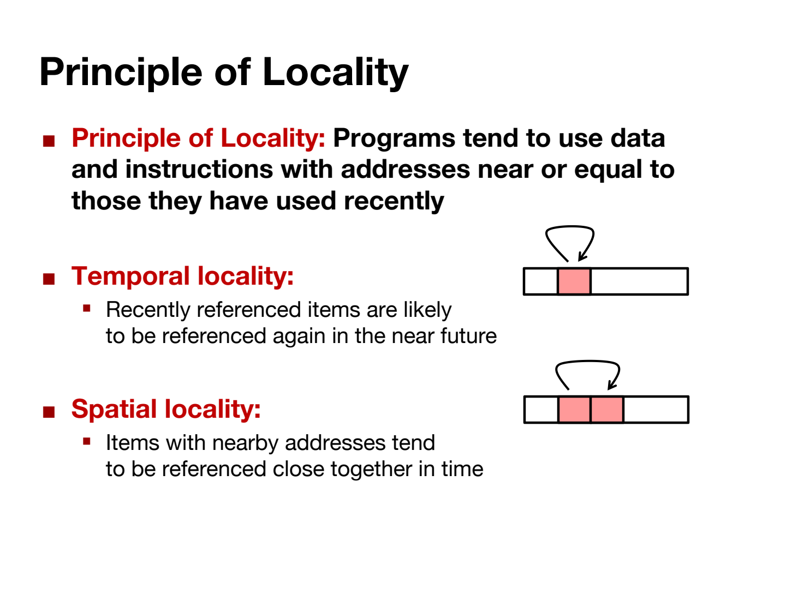

- **定义（原文）** ：Programs tend to use data and instructions with addresses **near or equal to** those they have used recently. 程序总倾向于访问"最近访问过的"或"地址相邻的"数据和指令。
- **Temporal locality（时间局部性）** ：recently referenced items are likely to be referenced again soon. 刚用过的数据/指令马上很可能再用，例：循环里的累加变量 `sum`。
- **Spatial locality（空间局部性）** ：items with nearby addresses tend to be referenced close together in time. 访问某个地址后，附近地址很可能马上被访问，例：顺序遍历数组 `a[0], a[1], a[2], ...`。

### 2.1 Locality Example

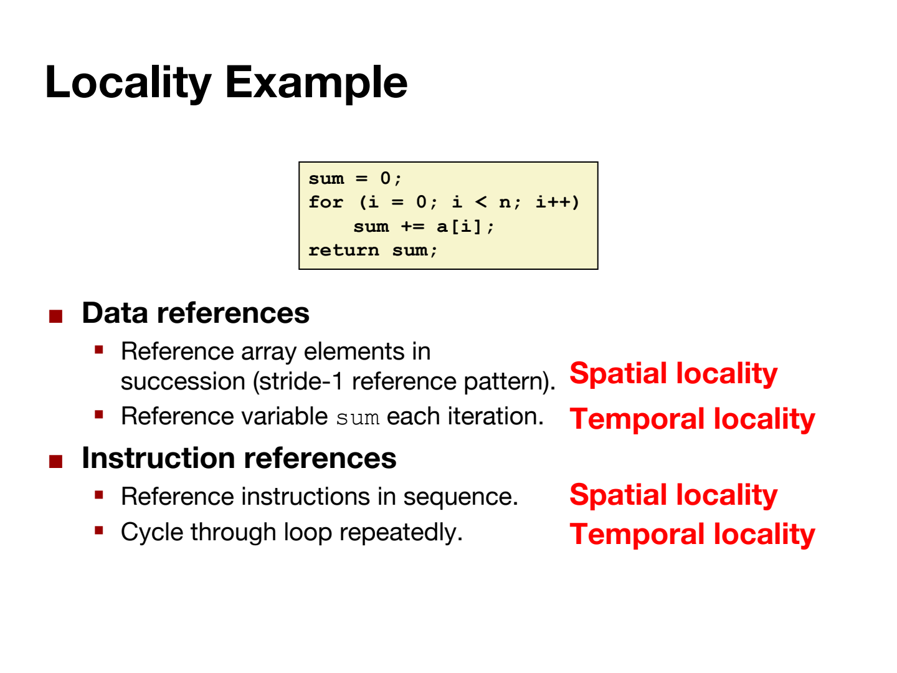

```c
sum = 0;
for (i = 0; i < n; i++)
    sum += a[i];   // 每次迭代：读 a[i]，累加进 sum
return sum;
```

| 现象 | 类型 |
|---|---|
| 数组元素 `a[0]→a[1]→a[2]…` 依次访问 | Spatial locality（数据） |
| 变量 `sum` 每次循环都用 | Temporal locality（数据） |
| 指令按顺序一条条执行 | Spatial locality（指令） |
| 循环体被反复执行 | Temporal locality（指令） |

> **为什么这是硬件设计的地基** ：局部性是 **所有程序** 的普适规律，硬件工程师才敢花昂贵的硅片面积做 cache——赌的就是"你现在用的东西等下还要用，你用这个地址等下要用它隔壁"。代码越符合 locality，硬件帮你的就越多。

---

## 3. Memory Hierarchy

**核心问题** ：为什么不把整个电脑都用最快的存储来造？

- **硬约束** ：越快的存储技术，每字节越贵、容量越小、发热越大（faster = costlier + smaller + hotter）。
- **工程解法** ：利用 locality 造一个金字塔——**每一层都是下一层的 cache（暂存区）** 。

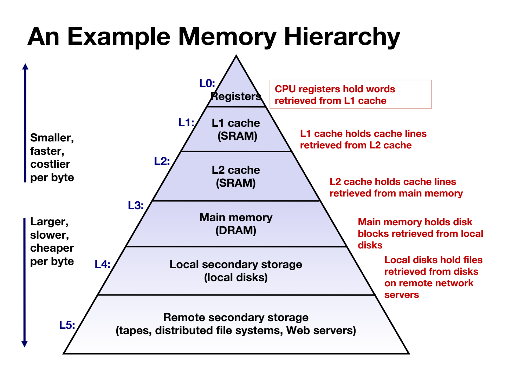

读图要点（右侧红字是每层的"职责"）：

- **L0 Registers** ：hold words retrieved from L1 cache（寄存器装着从 L1 取来的数）
- **L1 cache** ：holds cache lines retrieved from L2
- **L2 cache** ：holds cache lines retrieved from main memory
- **L3 Main memory (DRAM)** ：holds disk blocks retrieved from local disks
- **L4 Local disks** ：hold files retrieved from remote servers
- **L5 Remote storage** ：磁带、分布式文件系统、网盘等

### 3.1 Access Latency Numbers

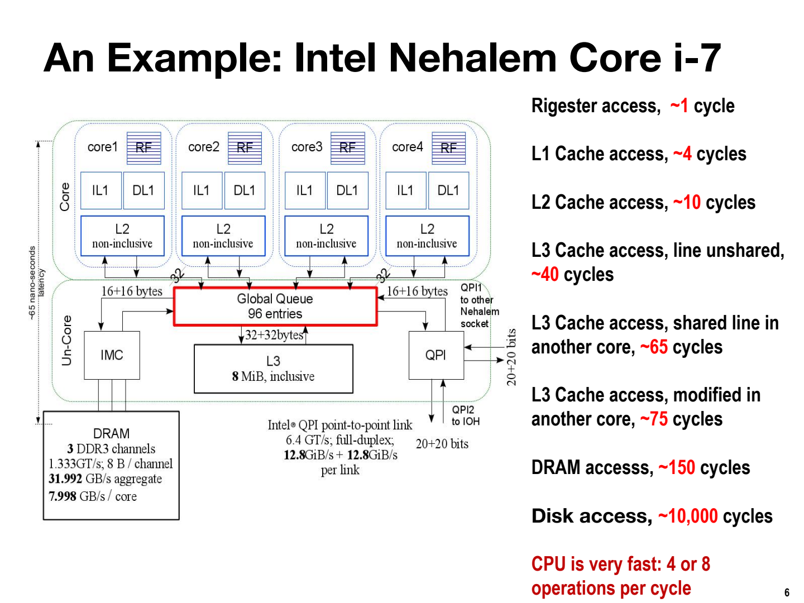

| 层级 | 典型容量 | 访问延迟（cycles） |
|---|---|---|
| Register 寄存器 | ~32–64 个 | ~1 |
| L1 cache | ~16 KB | ~4 |
| L2 cache | MB 级 | ~10 |
| L3 cache | 几 MB | ~40–75 |
| Main memory 内存 (DRAM) | GB 级 | ~150 |
| Disk 磁盘 | TB 级 | ~10,000+ |

- **冲击力对比** ：CPU 一个 cycle 能做 4–8 次运算；从内存搬一个数却要 ~150 cycles → **搬一次数的时间够算几百上千次** 。
- **层级规则** ：数据 **不能跨级直取** ，必须逐级搬运（memory → L3 → L2 → L1 → register），这是硬件固定规则。

> **冰箱类比** ：做早餐时食材从冰箱（cache）随手拿，空了才去沃尔玛（memory/disk）采购。没人会为做一个煎蛋专门跑一趟超市——但不懂硬件的程序员每天都在让程序这么干。

---

## 4. The Bottleneck Is Data Movement, Not Computation

**核心问题** ：为什么程序逻辑都对，却慢得要命？

写 `c = a + b` 时，机器实际做了 4 步：

1. `a` 从 memory → cache → register（可能 ~150 cycles）
2. `b` 同样搬一遍
3. CPU 在 register 里做加法（< 1 cycle）
4. 结果从 register 写回 memory

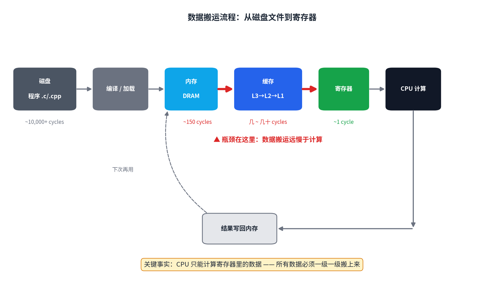

- 编译器（compiler）自动生成第 1、2、4 步且 **不告诉你**——高级语言的"体贴"，正是性能杀手。
- 后果：机器 ~99% 的时间在搬数据，CPU 大部分时间在 **空等（idle）** 。

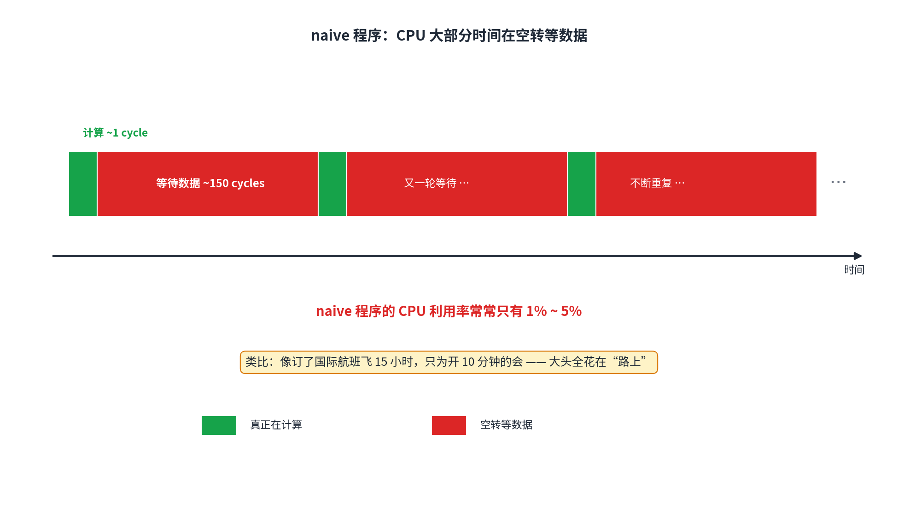

- Naive programs：CPU utilization 常只有 **1%–5%** ；expert-level programs：可达 **95%** 。

> **反直觉案例** ：有研究把算法复杂度从 O(n³) 降到 O(n²)，程序却反而更慢——瓶颈根本不在计算次数，而在数据搬运。CPU 反正闲着，减少计算量等于"给闲人减负"。 **降复杂度 ≠ 提速；减少搬运 = 提速。**

---

## 5. Case Study: Matrix Multiply with Register Reuse

全课第一个优化案例，务必逐行吃透。

### 5.1 What Is Matrix Multiplication（线性代数补丁）

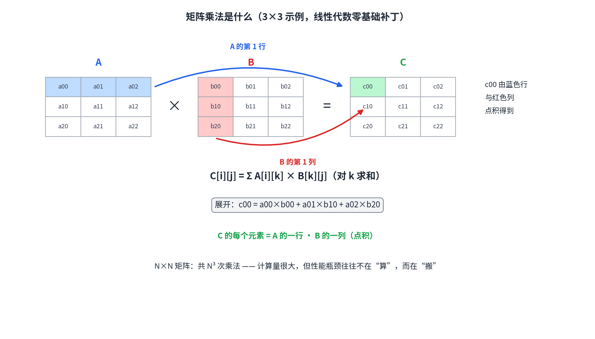

- 两个 N×N 矩阵相乘： **C 的第 (i,j) 个元素 = A 的第 i 行 · B 的第 j 列** （对应元素两两相乘再求和）。Entry (i,j) of C = dot product of row i of A and column j of B.

$$C[i][j] = \sum_{k=0}^{N-1} A[i][k] \times B[k][j]$$

- 3×3 手算一个元素：`c00 = a00·b00 + a01·b10 + a02·b20`。
- 每个元素 N 次乘法，共 N² 个元素 → 总计 **N³ 次乘法** ，即 O(N³)。
- 课上算的是 `C = C + A×B`（累加形式，AI 训练的核心运算），与上面只差"加到 C 的旧值上"，本质一样。

### 5.2 C Crash Course（看懂本课所有代码所需）

| 语法 | 含义 |
|---|---|
| `for (i=0; i<n; i++)` | 循环：i 从 0 开始；每次循环体跑完 i 加 1；当 `i<n` 为真就继续 |
| `i++` | `i = i + 1` 的简写 |
| `i += 2` | `i = i + 2` 的简写（步长为 2 的循环会用） |
| `x += y` | `x = x + y` |
| `a[i]` | 数组 a 的第 i 个元素（ **从 0 开始数** ） |
| `double` | 双精度浮点数，一个数占 8 bytes |
| `/* ... */` | 注释，计算机忽略，给人看的 |

### 5.3 1D Array as 2D Matrix（编程补丁）

```c
double *c = malloc(n * n * sizeof(double));  // 申请 n×n 个 double 的连续内存
// 第 i 行第 j 列的元素 = c[i*n + j]
```

- 内存是一维长条；矩阵按 **行优先（row-major）** 铺入：第 0 行占位置 0 ~ n-1，第 1 行占 n ~ 2n-1，依此类推。所以第 i 行第 j 列 = `i*n + j`。
- 验证：2×2 矩阵，元素 (1,0) → `1*2+0 = 2`，即一维数组第 3 个格子。✓
- `c[i][j]`（二维写法）和 `c[i*n+j]`（一维写法） **完全等价** ，考试和作业里都会出现，要会互相翻译。

### 5.4 v0 · The Naive Version

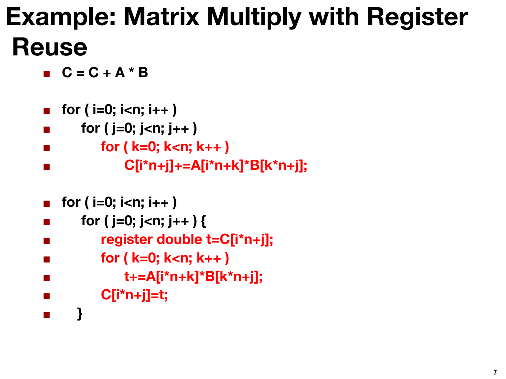

```c
for (i = 0; i < n; i++)              // 外层：遍历 C 的第 i 行
    for (j = 0; j < n; j++)          // 中层：遍历 C 的第 j 列
        for (k = 0; k < n; k++)      // 内层：k 从 0 到 n-1，累加 A[i][k]*B[k][j]
            C[i*n+j] += A[i*n+k] * B[k*n+j];
```

- 逻辑：对每个 (i,j)，让 k 从 0 走到 n-1，把 `A[i][k]×B[k][j]` 一项项加进 `C[i][j]`。
- 逻辑正确，性能灾难——原因要看 C 代码背后的 **汇编（assembly）** 。

### 5.5 Under the Hood: Assembly View

`C[i][j] += A[i][k] * B[k][j]` 这一行 C 代码，编译后内层循环实际是：

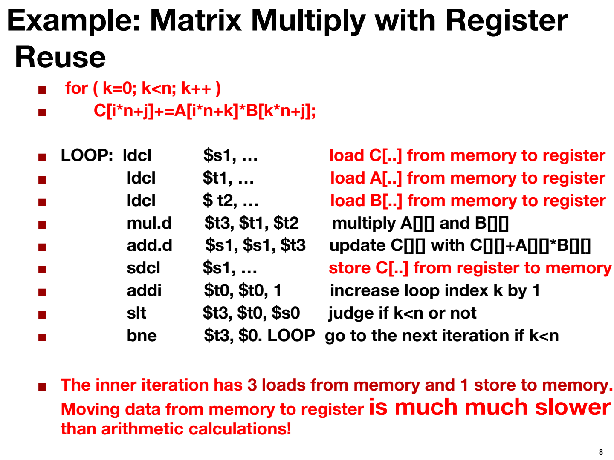

| # | 汇编指令 | 中文解释 | 耗时量级 |
|---|---|---|---|
| ① | `ldcl $s1, ...` | load：把 C[..] 从内存搬到寄存器 $s1 | 可能 ~150 cycles |
| ② | `ldcl $t1, ...` | load：把 A[..] 从内存搬到寄存器 $t1 | 可能 ~150 cycles |
| ③ | `ldcl $t2, ...` | load：把 B[..] 从内存搬到寄存器 $t2 | 可能 ~150 cycles |
| ④ | `mul.d $t3, $t1, $t2` | 乘法：$t3 = $t1 × $t2（寄存器内） | <1 cycle |
| ⑤ | `add.d $s1, $s1, $t3` | 加法：$s1 = $s1 + $t3（寄存器内） | <1 cycle |
| ⑥ | `sdcl $s1, ...` | store：把 $s1 从寄存器写回内存 C[..] | 可能 ~150 cycles |
| ⑦ | `addi $t0, $t0, 1` | k = k + 1 | <1 cycle |
| ⑧ | `slt $t3, $t0, $s0` | 判断 k < n ？（set if less than） | <1 cycle |
| ⑨ | `bne $t3, $0, LOOP` | 若 k<n 成立则跳回 LOOP（branch if not equal） | <1 cycle |

- **汇编速成** ：`ldcl` = load（memory→register）；`sdcl` = store（register→memory）；`mul.d` / `add.d` = 双精度乘/加；`$s1` 等 = 寄存器名字。不需要会写汇编，能认出"哪几条在搬数据"即可： **①②③⑥ 这 4 条** 。

**数账（考试就考这种）** ：

- 内层每迭代 1 次： **4 次内存传输** （3 loads + 1 store），只有 2 次计算（1 mul + 1 add）。
- k 循环跑 N 次 → 每算一个 `C[i][j]` 传输 **4N** 次。
- 全部 N² 个元素 → 总传输 **4N³** 次。

### 5.6 v1 · Register Reuse Version

```c
for (i = 0; i < n; i++)
    for (j = 0; j < n; j++) {
        register double t = C[i*n+j];          // ★ 循环外：C 搬进寄存器，只搬 1 次
        for (k = 0; k < n; k++)
            t += A[i*n+k] * B[k*n+j];          // 循环内：累加的是寄存器 t，不碰内存
        C[i*n+j] = t;                          // ★ 循环外：算完一次性写回内存
    }
```

- **为什么对** ：i、j 固定时，`C[i][j]` 在整个 k 循环里是 **同一个内存位置** 。
  - v0 每次迭代都"load → 加一下 → store"，等于反复搬运同一个数。
  - v1 用临时变量 `t`（编译器分配到 register）在循环内累加 → 对 C 的 N 次 load + N 次 store 压缩成 **1 次 load + 1 次 store** 。
- **`register` 关键字** ：给编译器的"建议"，请求把变量放寄存器。现代编译器对 `double t` 这种小变量本来就会尽量这么做，不写效果通常一样；写上是为了强调意图。但注意： **数组永远在内存** （编译器不知道数组多大），不会自动进寄存器。

对应的汇编（PPT p.9）：`ldcl C` 和 `sdcl C` 两条被移到了 LOOP 之外——这就是全部差别。

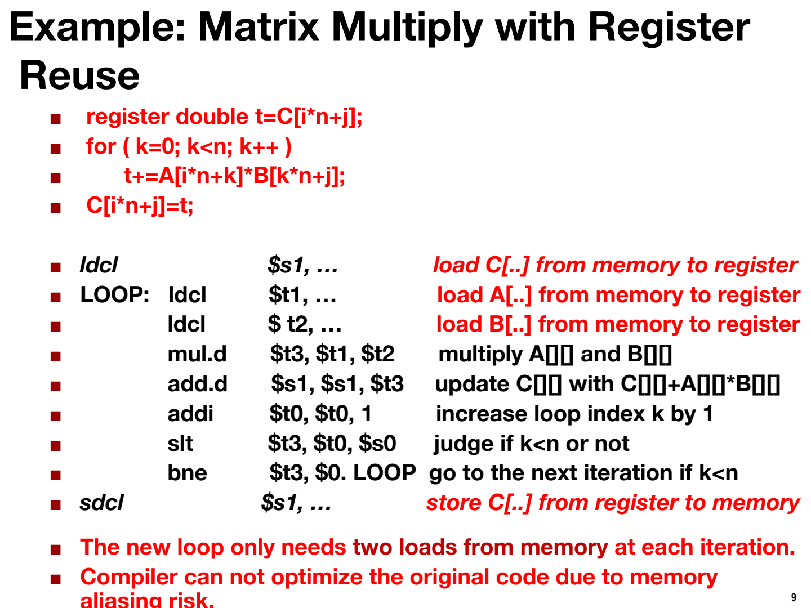

### 5.7 The Numbers

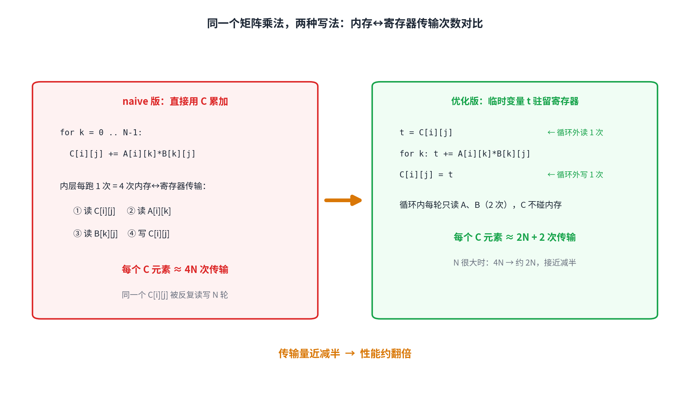

| | v0 naive | v1 register reuse |
|---|---|---|
| 每个 C[i][j] 的传输次数 | 4N | 2N + 2 |
| 全部元素总传输 | **4N³** | **2N³ + 2N²** |
| 计算量（flops） | 2N³ | 2N³（相同） |

- 计算量完全相同， **搬运量近乎减半 → 性能约 2 倍** 。

### 5.8 Counter-intuitive Facts

- 只看 C 代码行数，v1 比 v0 **多 2 行**——"代码少 = 快"的直觉是错的。
- **快慢要看汇编层的搬运次数，不看 C 代码行数。**
- 编译器能自动完成 v0→v1 这种简单优化；但更深层的优化（Lec 02 的 tiling） **编译器做不到，必须手写**——这就是这门课存在的意义。

---

## 6. Self-check

合上笔记做，答案在最后。

1. Explain temporal locality and spatial locality in your own words, with one code example each.（用自己的话解释时间/空间局部性，各举一个代码例子。）
2. Why can't data go directly from memory to registers?（为什么数据不能从内存直接进寄存器？）
3. Why is CPU utilization only 1%–5% in naive programs? What is the CPU waiting for?
4. In `C[i*n+j]`, if n=4, what is the 1D index of element (2,3)?
5. In v0's inner loop, what are the 4 memory transfers? Which ones does v1 eliminate?
6. An algorithm was improved from O(n³) to O(n²) but the program got slower. Explain why using this lecture's worldview.

<details>
<summary><b>Answers</b></summary>

1. Temporal: same data/instruction reused soon — e.g. loop accumulator `sum`. Spatial: nearby addresses accessed together — e.g. traversing `a[0..n-1]` in order.
2. Hardware rule: computation happens only in registers; data must move level by level (disk→memory→L3→L2→L1→register), no level-skipping.
3. Most time the CPU waits for data to travel from memory/cache to registers (~150 cycles per trip); computation takes <1 cycle, so utilization is tiny.
4. `2*4+3 = 11`.
5. Load C, load A, load B, store C. v1 notices C[i][j] is the same location for the whole k-loop, accumulates in register `t`, collapsing N loads + N stores of C into 1 load + 1 store.
6. The bottleneck is data movement, not computation. The CPU is idle anyway, so cutting computation doesn't cut waiting time; if the new algorithm also hurts locality (more transfers), it gets slower.

</details>
