# Lec 02 · Aggressive Register Reuse & Cache Basics

> Slides: `optimizing-sequential-programs` p.2–16
> Prerequisite: [Lec 01](lec01-intro-and-locality.md)

**TL;DR**

- **Register level**：naive 矩阵乘法里每个 A 元素要被搬 N 次；解法是**分块（Tiling/Blocking）**——切成 2×2 小块、整块装进 12 个 registers 算完再换下一块。每个数"load 1 次，用 2 次"，总传输量从 4N³ 降到 N³ 量级。
- **Cache level**：内存↔缓存按 **cache line** 整块搬运（本课约定 1 line = 4 doubles）；Cache Miss 惩罚约 100 cycles，命中率 97%→99% 性能就翻倍。
- **优化顺序**：先 register，再 cache——一层一层来（optimize the fastest level first）。

---

## 1. Recap of Lec 01

- Locality = **temporal**（同一数据反复用）+ **spatial**（相邻数据连着用）。
- Memory hierarchy：register（~1 cycle）→ L1（~4）→ L2（~10）→ L3（~40-75）→ memory（~150）→ disk（~10⁴⁺）。
- CPU 只能算 register 里的数；搬运远慢于计算 → naive 程序 CPU utilization 仅 1%–5%。
- v0 → v1：把 `C[i][j]` 的读写移出内层循环，传输量 4N³ → 2N³+2N²。

---

## 2. Sizes & Latencies（计算题要用）

| 层级 | 典型容量 | 访问延迟 | 类比 |
|---|---|---|---|
| Register | 仅 ~32–64 个（每个存 1 个数） | ~1 cycle | 就在手边 |
| L1 cache | ~16 KB data + 16 KB instruction | ~4 cycles | 办公桌上 |
| L2 cache | 几 MB | ~10 cycles | 下楼到宿舍 |
| Main memory (DRAM) | 几 GB | ~100–150 cycles | 回一趟老家 |
| Disk | 1–2 TB | ~数十万–百万 cycles | 跨国航班 |
| Remote disk（网盘） | 近乎无限 | 更慢 | 国际快递 |

> 如果没学过 computer architecture / organization，这张表必须记住——"电脑里有多级硬件存储，越远越慢"是本课一切推理的起点。

## 3. Life of a Program（编程基础补丁）

**核心问题**：我写的 `.cpp` 文件和"正在运行的程序"之间发生了什么？

```
Source code（.c/.cpp 文件）── 存在 disk 上，关机不消失
        │  compile（编译）
        ▼
Executable（可执行文件）── 还是 disk 上的一个文件
        │  run：操作系统把它 load 进 memory，启动一个 process
        ▼
程序在 memory 中运行 ── 数组等数据初始化在 memory
        │  每次计算时
        ▼
数据：memory → L3 → L2 → L1 → register → CPU 计算 → 结果逐级写回 memory
```

- **断电后谁还在**：disk 上的文件还在；memory、cache、register 内容全部消失（temporary storage）。
- **高级语言"骗"了你**：它故意隐藏 memory→cache→register 这条搬运链，让你以为 `c = a + b` 就是一次加法。数据结构课只数"计算次数"（time complexity），从不数"搬运次数"——这门课要把这本隐藏的账翻出来算。

---

## 4. Why Naive Is Still Slow: Same Number Loaded N Times

**核心问题**：v1 只优化了 C，A 和 B 还在被反复搬！

- 固定 `i` 和 `k`，让 `j` 从 0 跑到 N-1 → **同一个 `A[i][k]` 参与计算 C 的一整行**：`C[i][0]`, `C[i][1]`, …, `C[i][N-1]` 都要用它。
- 拿 3×3 矩阵走一遍（算 C 的第一行）：

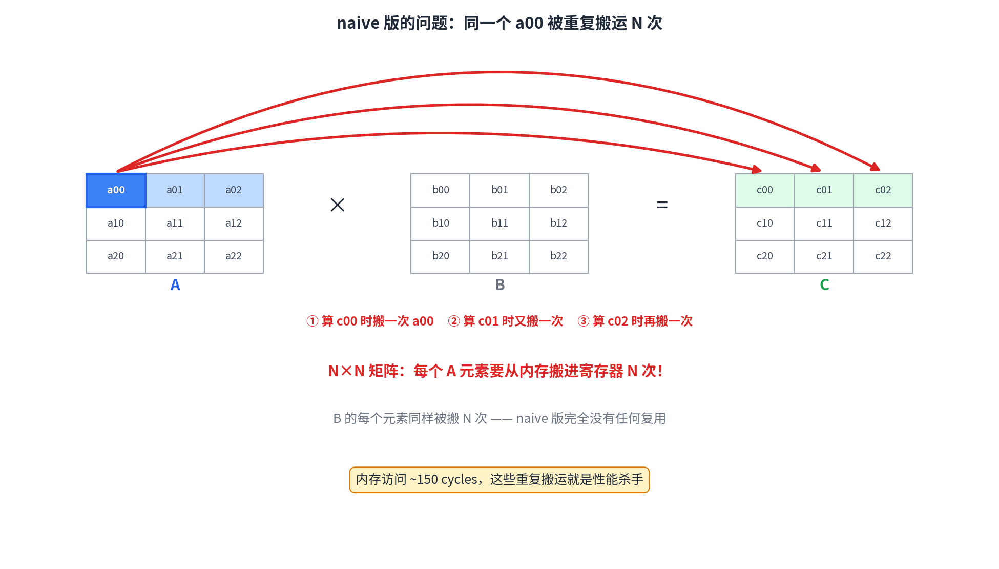

1. 算 `c00`：第 1 行 × 第 1 列，需要 `a00` → 从 memory 搬进 register，**第 1 次**
2. 算 `c01`：第 1 行 × 第 2 列，又要 `a00` → **第 2 次**
3. 算 `c02`：第 1 行 × 第 3 列，还要 `a00` → **第 3 次**

- 3×3 搬 3 次 → **1000×1000 的矩阵，`a00` 要被搬 1000 次**。
- 每次搬运 ~100 cycles，计算 < 1 cycle → 这就是 CPU utilization 只有 1%–2% 的原因。
- **结论**：结果正确 ≠ 代码好。浪费 98% 的硬件资源 = 浪费钱，这种代码没有工程价值。

---

## 5. Register Reuse: Three Levels

### 5.1 Level 1 · Reuse C（Lec 01 的 v1）

- 内层循环用 register 变量 `t` 累加，C 的读写从 2N 次降到 2 次。
- **遗留问题**：A、B 的元素仍然每次用、每次搬。

### 5.2 The Ultimate Idea: Everything in Registers

- 最理想：每个元素配一个 register，全部数据**只搬一次**，所有计算在 register 内完成。
- **为什么不现实**：
  - 3×3 矩阵、三个矩阵共 27 个数 → 27 个 registers，勉强够。
  - 1000×1000 矩阵 → **300 万个数**，而 CPU 只有约 32 个 registers。
  - **Out of register** 之后，系统会**不声不响地**把多出的数据放回 memory，前功尽弃。

> 通用框架：out of register → out of L1 → out of L2 → out of L3 → out of memory——**每层都会"装不下"，优化的艺术就是在每层容量限制下最大化 reuse**。

### 5.3 Level 2 · Tiling / Blocking

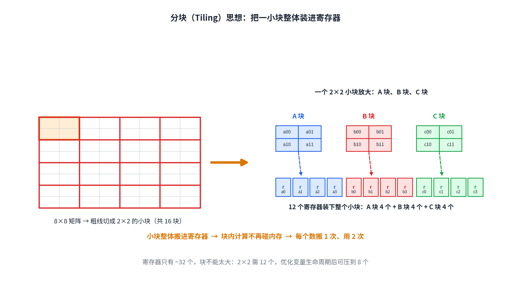

**核心思想**（当今所有工业级矩阵乘法库的真实做法，CPU/GPU 通用）：

1. 把大矩阵切成 2×2 小块（mini-blocks）
2. 一个小块的所有元素**能同时装进 registers**
3. 块内计算完全不碰 memory
4. 算完换下一块

**为什么是 2×2**：A 块、B 块、C 块各 4 个元素，共 **12 个 registers** 装下（32 个 registers 够用）；3×3 要 27 个，勉强；再大就 out of register。

#### The idea in code（PPT p.10）

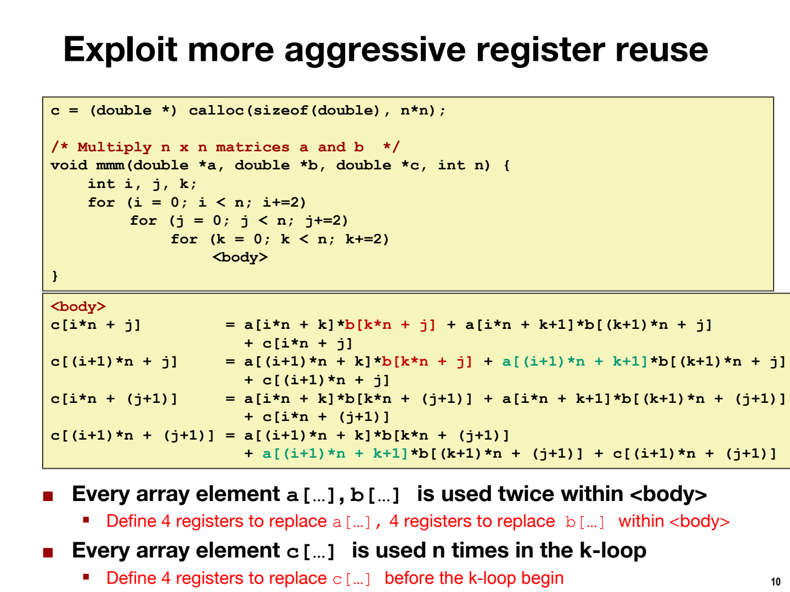

```c
for (i = 0; i < n; i += 2)        // i 步长 2：每次处理 C 的 2 行
    for (j = 0; j < n; j += 2)    // j 步长 2：每次处理 C 的 2 列 → 合起来是 2×2 的 C 块
        for (k = 0; k < n; k += 2)// k 步长 2：每次取 A、B 的 2×2 小块
            <body>                // 4 个 c 元素各自累加 2 项（见下）
```

`<body>` 展开（以 C 块左上角 (i,j) 为例，注意下标规律）：

```c
c[i*n + j]       += a[i*n + k]*b[k*n + j]       + a[i*n + k+1]*b[(k+1)*n + j];
c[(i+1)*n + j]   += a[(i+1)*n + k]*b[k*n + j]   + a[(i+1)*n + k+1]*b[(k+1)*n + j];
c[i*n + j+1]     += a[i*n + k]*b[k*n + j+1]     + a[i*n + k+1]*b[(k+1)*n + j+1];
c[(i+1)*n + j+1] += a[(i+1)*n + k]*b[k*n + j+1] + a[(i+1)*n + k+1]*b[(k+1)*n + j+1];
```

PPT p.10 红字结论：

- **Every array element a[...], b[...] is used twice** within `<body>` → 用 4 个 registers 装 a 块、4 个装 b 块（load 1 次用 2 次）。
- **Every c[...] is used n times in the k-loop** → k 循环开始前就用 4 个 registers 装好 c 块（全程住在 register）。

#### The full code（PPT p.11，12 registers）

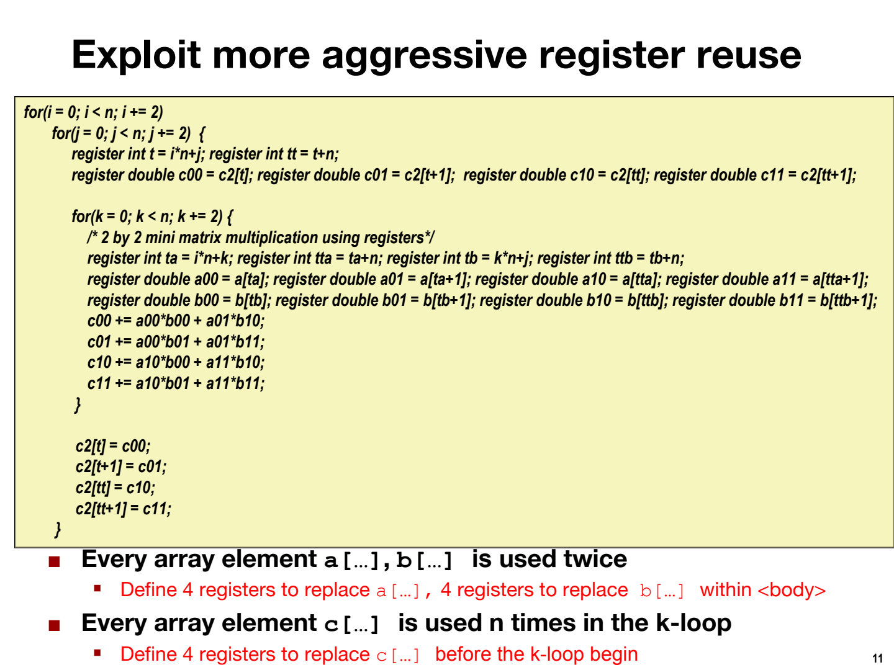

```c
for (i = 0; i < n; i += 2)
    for (j = 0; j < n; j += 2) {
        register int t  = i*n + j;          // C 块左上角的一维下标
        register int tt = t + n;            // C 块左下角下标（下一行 = +n）
        // ★ k 循环前：C 块 4 个元素装进 4 个 registers，整个 k 循环常驻
        register double c00 = c2[t];   register double c01 = c2[t+1];
        register double c10 = c2[tt];  register double c11 = c2[tt+1];

        for (k = 0; k < n; k += 2) {
            /* 2 by 2 mini matrix multiplication using registers */
            register int ta = i*n + k;   register int tta = ta + n;  // A 块下标
            register int tb = k*n + j;   register int ttb = tb + n;  // B 块下标
            // ★ A 块 4 个、B 块 4 个，各 load 1 次
            register double a00 = a[ta];   register double a01 = a[ta+1];
            register double a10 = a[tta];  register double a11 = a[tta+1];
            register double b00 = b[tb];   register double b01 = b[tb+1];
            register double b10 = b[ttb];  register double b11 = b[ttb+1];
            // ★ 块内计算：8 mul + 4 add，全部在 registers 内，零 memory 访问
            c00 += a00*b00 + a01*b10;
            c01 += a00*b01 + a01*b11;
            c10 += a10*b00 + a11*b10;
            c11 += a10*b01 + a11*b11;
        }
        c2[t] = c00;    c2[t+1] = c01;      // ★ 算完才写回 memory，各 1 次
        c2[tt] = c10;   c2[tt+1] = c11;
    }
```

#### How to read the variable names（命名规律）

- `c00` = C 块第 0 行第 0 列；`c01` = 第 0 行第 1 列；`c10`、`c11` 同理。a、b 一样。
- 下标变量：`t` = target（C 块左上）；`tt` = t + n（正下方）；`ta/tta` = A 块位置；`tb/ttb` = B 块位置。
- 行优先布局的方位口诀：**+1 = 右边一格；+n = 下边一格**。

#### Trace it with N=4（手动走一遍 k 循环）

固定 `i=0, j=0`（处理 C 左上角 2×2 块：`c00 c01 / c10 c11`）：

| k | load 进 register 的数 | 块内计算（累加进 c 寄存器） |
|---|---|---|
| k=0 | A 块 = a[0][0], a[0][1], a[1][0], a[1][1]；B 块 = b[0][0], b[0][1], b[1][0], b[1][1] | c00 += a00·b00 + a01·b10 等 4 行 |
| k=2 | A 块 = a[0][2], a[0][3], a[1][2], a[1][3]；B 块 = b[2][0], b[2][1], b[3][0], b[3][1] | 再各累加 2 项 |

- 两轮下来，每个 c register 累加了 4 项 = 正好是"行 · 列"的完整点积。✓
- **c00–c11 全程没碰过 memory**：只在 k 循环前 load 一次、循环后 store 一次。

#### Why blocked multiplication is correct（线性代数补丁）

- 把矩阵按 2×2 切块后，**乘法规则不变，只是"元素"变成"小块"**：

$$C_{块} = \sum_{k块} A_{块} \times B_{块}$$

- 两个 2×2 小块相乘再相加，展开正好就是代码里那 4 行——如 `c00 += a00*b00 + a01*b10` = 块乘法的 (0,0) 元素 = A 块第 0 行 · B 块第 0 列。
- 加法满足交换律/结合律（浮点有极微小差异，本课不考虑）→ 分块只是改变求和分组，结果不变。

#### The numbers: load once, use twice（考试级别推导）

- 每个 2×2 C 块：k 循环外搬 C 共 8 次（4 loads + 4 stores）。
- k 循环跑 N/2 轮，每轮 load A 块 4 个 + B 块 4 个 = 8 次 → 共 4N 次。
- 每块合计 **4N + 8** 次传输，产出 4 个 C 元素 → 平均每个元素 **N + 2** 次。
- 全矩阵 N² 个元素 → 总传输 **N³ + 2N²**。

| 版本 | 总传输次数 | 每个数据平均搬运 |
|---|---|---|
| v0 naive | 4N³ | 每用 1 次搬 1 次 |
| v1（reuse C） | 2N³ + 2N² | C 搬 1 次用 N 次；A、B 没改善 |
| v2（2×2 tiling） | **N³ + 2N²** | A、B、C 都 load 1 次用 2 次 |

> 3×3 分块 = "load 1 次用 3 次"，4×4 更省——但 **register 装不下**。这就是 reuse 次数 vs register 数量的根本权衡；可能的考题：给定 register 数量，最多能 reuse 几次？

### 5.4 Level 3 · Register Lifetime: 12 → 8（PPT p.12）

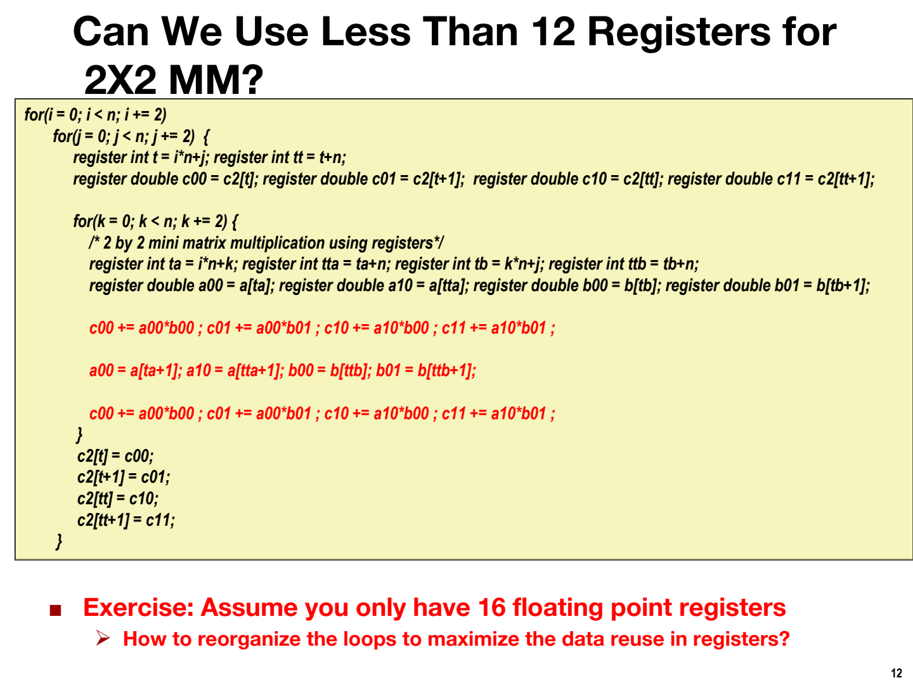

- 观察：`a00` 在 `c00 += a00*b00; c01 += a00*b01;` 用完之后，这个 register 就"死"了（**lifetime 结束**）。
- 让下一个数据复用同一个 register 位置；B 块同理压缩。
- 结果：同样性能只需 **8 个 registers**。register 省下来，才能腾地方做更大的块。
- 可能的考题："这个版本最少需要几个 registers？"

### 5.5 Three Follow-up Questions

- **Q：为什么让数据一直占着 register，而不是要用时才搬？**
  A：每个数要按计算顺序被用很多次（a00 要见完 B 的多个列）；调度好计算顺序后，常驻 register 反而最省搬运。
- **Q：块能开多大开多大吗？**
  A：受 register 数量硬约束。CPU 约 32 个 → 2×2 是甜区；**GPU 有成百上千个 registers** → 能开更大的块，这也是 GPU 适合矩阵运算的原因之一（但 GPU 贵得多）。
- **Q：矩阵边长不是 2 的倍数怎么办？**
  A：会出现 2×1、1×1 的边角块（boundary cases），代码必须单独处理——这是高性能代码"变丑变长"的原因之一。作业先假设整除。

### 5.6 The Compiler Won't Do This for You

- v0 → v1（reuse C）这种简单优化，好的编译器**可能**自动完成。
- 2×2 tiling 这种重构，**没有任何编译器会替你做，必须手写（by hand）**。
- 分水岭：高性能来自程序员对硬件的理解，不来自工具。

---

## 6. Cache: Hardware's Bulk Buying

### 6.1 Why Caches Exist

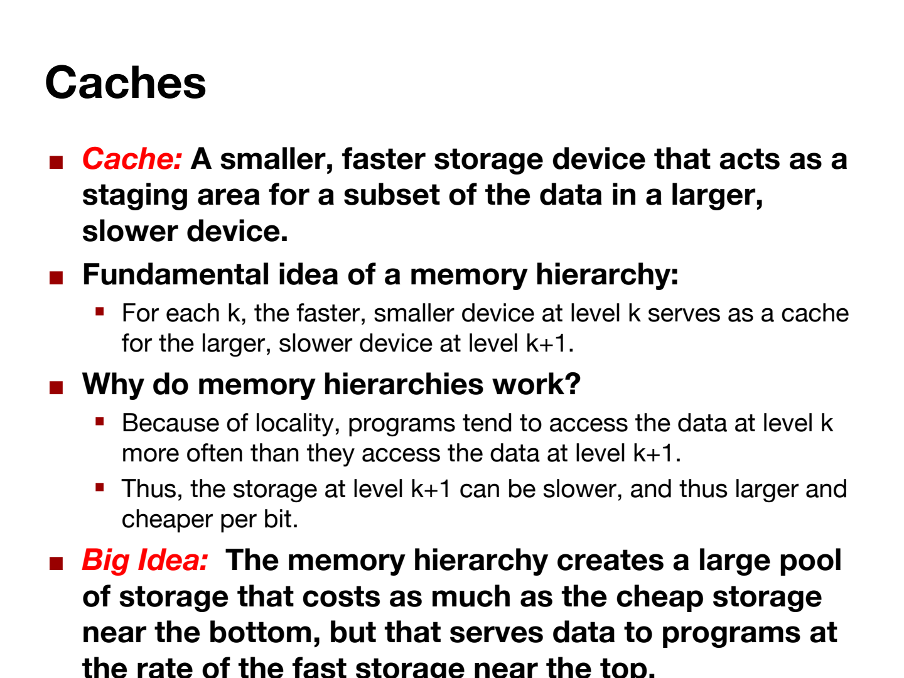

- **Cache（原文定义）**：a smaller, faster storage device that acts as a **staging area**（中转暂存区）for a subset of the data in a larger, slower device.
- **层级思想**：第 k 层的快存储，是第 k+1 层慢存储的 cache。
- **Big Idea（原文）**：memory hierarchy 造出一个"又大又便宜"的存储池，却**以最顶层的速度**为程序供数据——靠的就是 locality。

### 6.2 Cache Line: The Minimum Transfer Unit

**核心问题**：从 memory 搬一个数进 cache，成本是多少？

- **反直觉事实**：memory ↔ cache **从不按"个数"搬运**，而是按 **cache line 整块搬运**——哪怕只要 `a[0]` 一个数，硬件也把 `a[0]..a[3]` 一整行全搬进 cache。

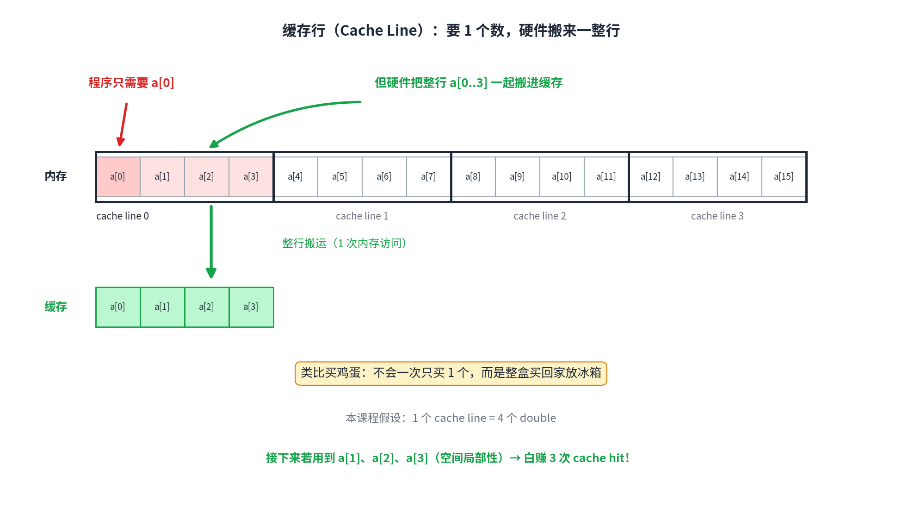

> **买鸡蛋类比**：没人去超市一次只买 1 个鸡蛋——整盒买回家放冰箱。"来回一趟"的成本固定，多装几个不额外花时间。同理：搬 1 个 double 和搬 4 个 double 耗时几乎一样，硬件索性一次搬一整行。

- **本课约定**：1 个 cache line = **4 个 doubles**（32 bytes）。作业考试按此计算；考题可能改成每行 10 个，方法不变。
- cache → register 则相反：**按个数（word）**一个个搬。
- **红利**：接下来若要用 `a[1]`, `a[2]`, `a[3]`（spatial locality），它们已在 cache 里 → 白赚 3 次快速访问。

### 6.3 Cache Hit & Cache Miss

- **Cache Hit（命中）**：数据在 cache 里 → 几 cycles 拿到。
- **Cache Miss（未命中）**：不在 cache → **必须**去 memory 搬（数据是任务要的，没得商量）→ 惩罚约 **50–200 cycles**。

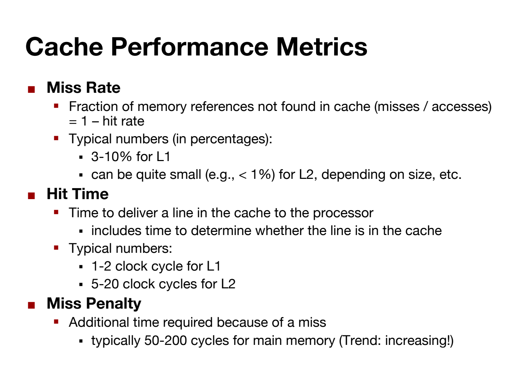

| 指标 | 含义 | 典型值 |
|---|---|---|
| **Miss Rate** 未命中率 | misses ÷ accesses（= 1 − hit rate） | L1 约 3%–10% |
| **Hit Time** 命中时间 | 命中时把数据送到 CPU 的耗时 | L1 约 1–2 cycles |
| **Miss Penalty** 未命中惩罚 | miss 后的额外耗时 | memory 约 50–200 cycles（趋势：越来越大） |

### 6.4 The Classic Calculation: 97% vs 99%（PPT p.15）

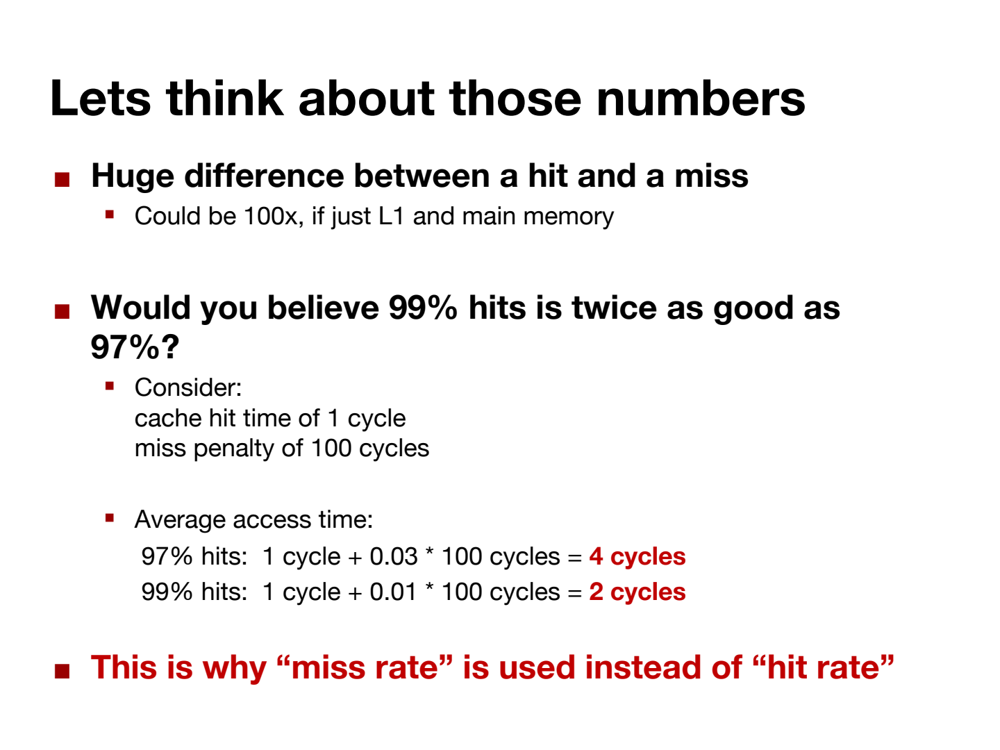

假设 hit time = 1 cycle，miss penalty = 100 cycles：

$$\text{Average access time} = \text{hit time} + \text{miss rate} \times \text{miss penalty}$$

- 97% hits：1 + 0.03 × 100 = **4 cycles**
- 99% hits：1 + 0.01 × 100 = **2 cycles**

**结论**：命中率只差 2 个百分点，平均速度快一倍！这就是业界用 **miss rate**（而不是 hit rate）做指标的原因——差异藏在尾部：99% vs 97% 听着差不多，实际差 2 倍。

### 6.5 Writing Cache Friendly Code（PPT p.16）

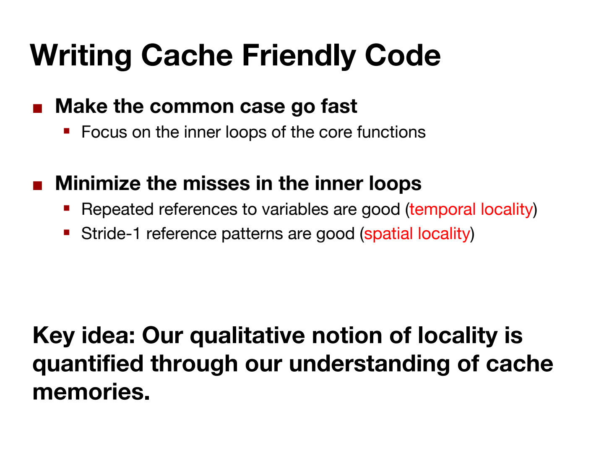

1. **Make the common case go fast**（让常见情况跑得快）——优化花在刀刃上。
2. **Focus on the inner loops** of the core functions（盯住核心函数的最内层循环）。
3. **Minimize the misses in the inner loops**（内层循环里最小化 miss）：
   - Repeated references to variables are good（temporal locality）
   - **Stride-1** reference patterns are good（spatial locality，步长为 1 挨着访问）

> **下节课预告**：换循环顺序（i/j/k 六种排列：ijk/jik/kij/ikj/jki/kji）是 **cache 层**的优化，六种顺序的 misses/iter 分别为 1.25 / 1.25 / 0.5 / 0.5 / 2.0 / 2.0（PPT p.20–26）——最好比最差少 4 倍 miss。

---

## 7. Engineering vs Theory

| | 理论课（算法/线代） | 本课（HPC 工程） |
|---|---|---|
| 关注点 | time complexity O(·)，常数因子无所谓 | **实际执行时间**，常数因子就是钱 |
| 典型心态 | "4n³ 降到 2n³？都是 O(n³)" | "4n³ → 2n³ = 硬件预算砍半" |
| 代码审美 | 简洁优雅 | 为性能牺牲可读性；工业级矩阵乘法可超 10,000 行 |

## 8. Optimization Roadmap

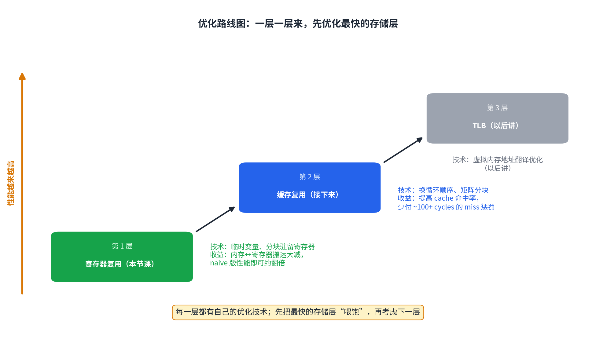

一层一层来，**先优化最快的存储层**：

1. **Register reuse（本节课，done）**：tiling + register 变量，减少 memory→register 搬运。
2. **Cache reuse（next）**：换循环顺序、cache blocking，提高 hit rate。
3. **TLB（later）**：页表缓存，后面会提。

> 顺序不能乱：**先 register、再 cache**。cache 优化（如换循环序）不会自动带来 register reuse，两层要分别做。

## 9. FAQ

**Q1：`register` 关键字是必须的吗？**
不是。现代编译器对小变量通常自动放 register，写上只是强调意图。真正重要的是"哪些数据值得常驻 register"这个**设计决策**。

**Q2：数组能放 register 吗？**
不能。编译器不知道数组多大，数组永远在 memory。所以只能手动 tiling，把一小块数组元素复制进一个个 scalar register 变量。

**Q3：既然换循环顺序也能提速，为什么不直接换？**
换循环顺序优化的是 **cache 层**（改变访问模式、提高 hit rate），不改变 register 层的搬运次数。两层是正交的优化，按"先 register 后 cache"的顺序分别做。

**Q4：分块后计算顺序变了，结果还一样吗？**
一样。矩阵乘法本质是 N³ 个乘加的和，加法满足交换律；分块只是改变求和分组方式。

**Q5：这套方法只适用于矩阵乘法吗？**
不是。**任何"同一数据被反复使用"的算法都能用这套思想**——排序、FFT、以后写的任何代码。条件反射：看到"同一数据用 N 次" →「它应该常驻 register/cache」。

---

## 10. Self-check

合上笔记做，答案在最后。

1. In a 1000×1000 naive matrix multiply, how many times is `a[0][0]` loaded from memory to a register? Why?
2. Why does the 2×2 tiled version need 12 registers? Which 4 does the 8-register version save?
3. Derive the total transfer count N³ + 2N² from "4N + 8 transfers per block".
4. Why can't we simply tile the matrix into 100×100 blocks?
5. If the program only needs `a[5]`, which elements does the hardware fetch into cache (cache line = 4 doubles)? Why is it designed this way?
6. hit time = 2 cycles, miss penalty = 150 cycles, miss rate = 2%: what is the average access time? If miss rate drops to 1%, how much faster?
7. Write the total execution time formula for v0 (computation = 1 cycle/op, transfer = T cycles/op, no overlap, N×N matrices).

<details>
<summary><b>Answers</b></summary>

1. 1000 次。固定 i=0, k=0 后，`a[0][0]` 参与 C 第 0 行全部 1000 个元素的计算，naive 版每次用都重新 load。
2. 要同时装 A 块 4 + B 块 4 + C 块 4 = 12 个数。8-register 版利用 lifetime：a00 用完后其位置立即被下一个数复用，B 块同理，省 4 个。
3. 全矩阵 (N/2)² = N²/4 个 C 块，每块 4N+8 次 → (N²/4)(4N+8) = N³ + 2N²。
4. 100×100 块含 3×10000 = 30000 个数，远超 ~32 个 registers；out of register 后数据被静默放回 memory，优化失效。
5. 搬 a[4]..a[7] 整行（a[5] 所在 cache line，行首对齐到 4 的倍数）。硬件赌 spatial locality：你大概率马上要用旁边的数；且搬 1 个和搬 4 个耗时几乎相同。
6. 2 + 0.02×150 = 5 cycles；降到 1% 后 = 2 + 1.5 = 3.5 cycles；平均时间减少 30%，即速度提升 5/3.5 ≈ 43%。
7. v0：计算 2N³ 次 × 1 + 传输 4N³ 次 × T → **T_total = 2N³ + 4N³·T**（cycles）。

</details>
